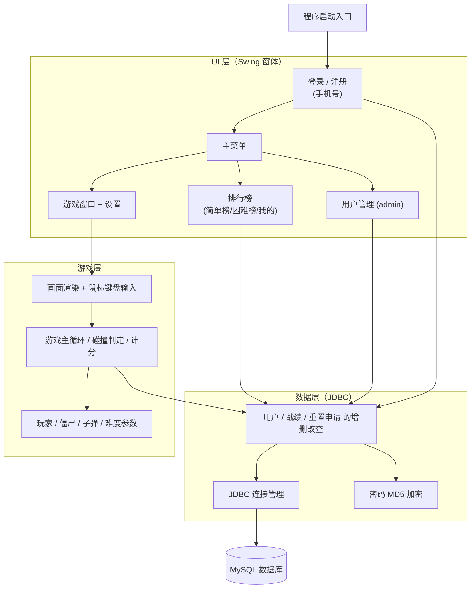
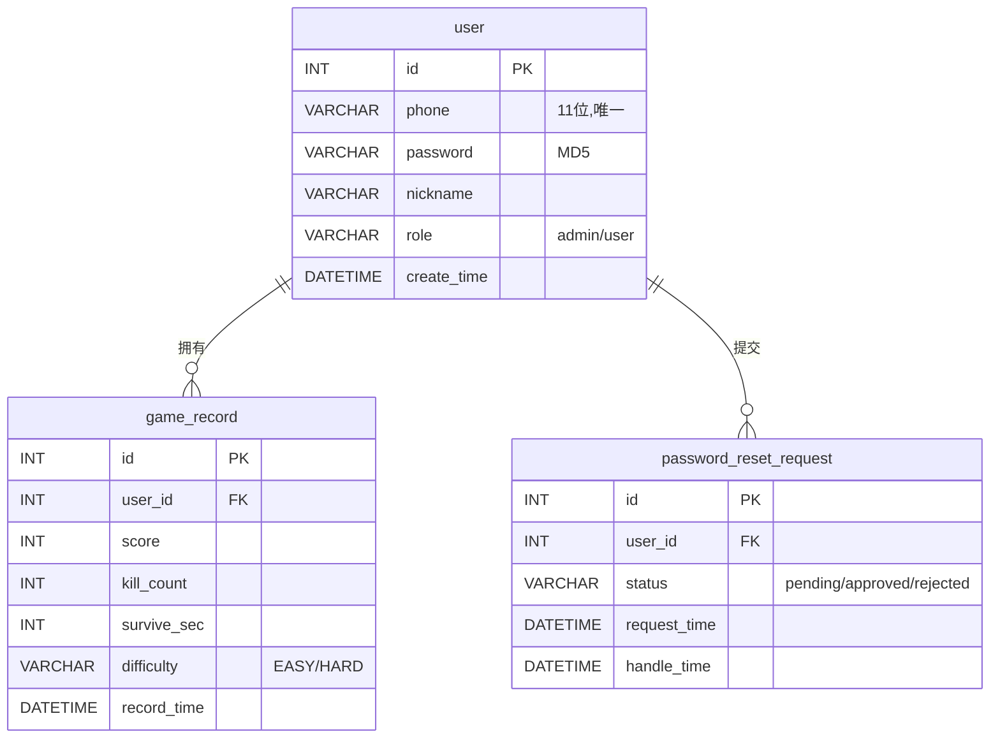
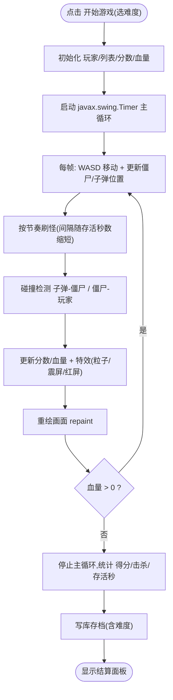
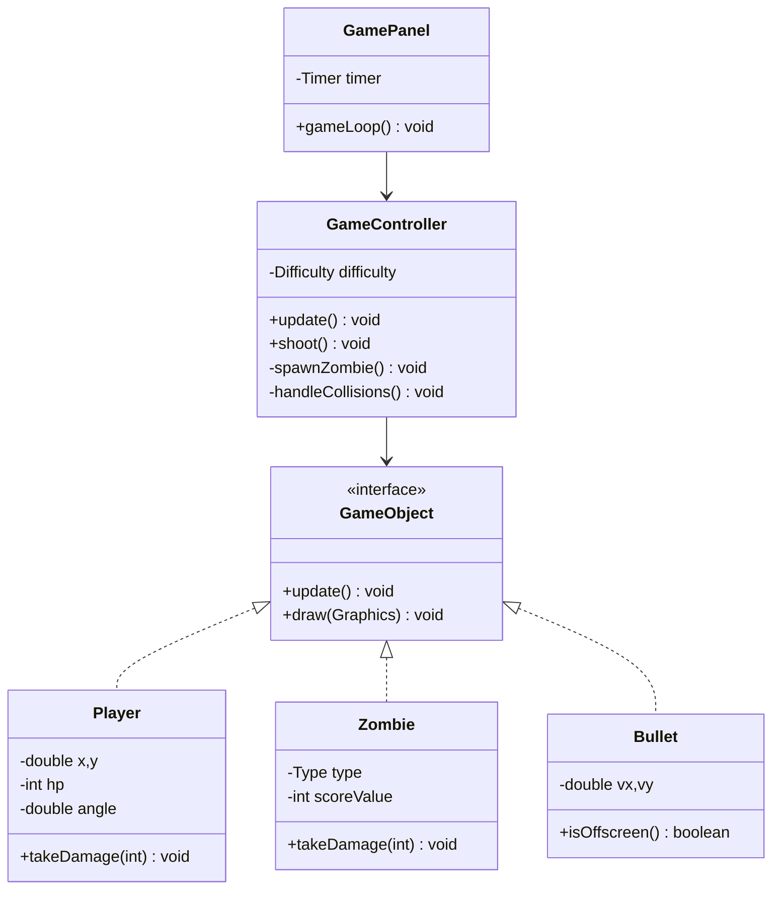
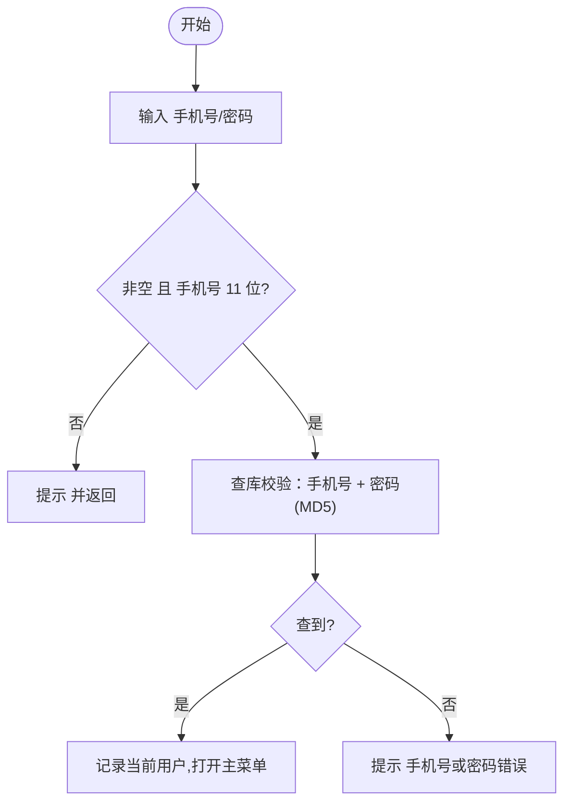
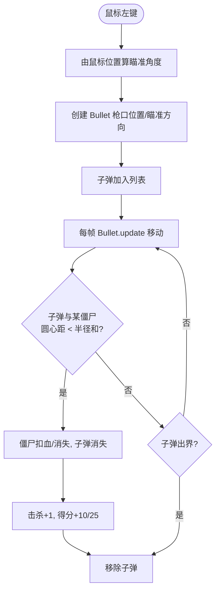
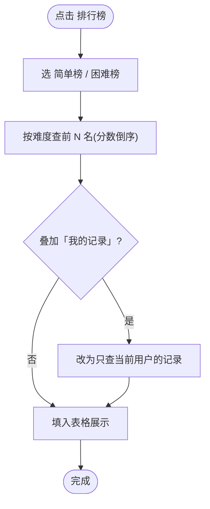
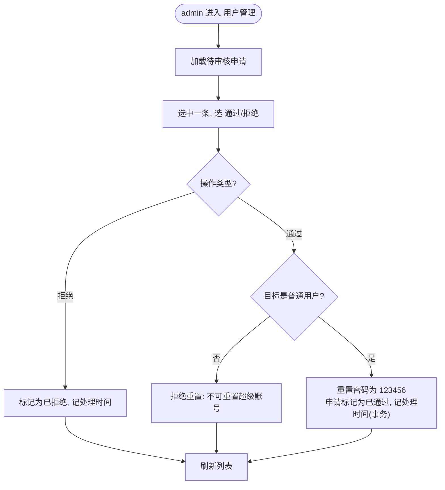

<div align="center">


## 课程设计说明书

### 技能训练（一）


---

## 1. 课程设计的目的及要求

### 1.1 目的

本项目是一门「Java 程序设计」与「数据库原理与应用」的**综合技能训练**。通过一个完整可玩、可交付的 2D 射击小游戏，综合运用面向对象思想、Java Swing 图形界面、JDBC 数据库访问与 MySQL 数据库设计，把两门课的知识在一个真实工程里贯通起来，培养分析、设计、编码、调试与撰写文档的工程能力。

### 1.2 要求

- 综合使用 Java + 数据库完成一个有界面、有数据持久化的完整系统；
- 体现**面向对象**（封装 / 继承 / 多态 / 抽象），代码符合规范（4 空格锯齿型缩进、K&R 花括号、统一命名、充分注释）；
- 必须包含**登录界面、主菜单**；
- 提交**总体结构图、流程图、UML 类图**等设计文档；
- 数据库设计合理（建表、主外键、SQL 增删改查）；
- 程序具备一定健壮性（异常处理、输入校验、连接失败友好提示），不崩溃。

---

## 2. 需求分析

### 2.1 问题陈述

设计并实现一款**单机 2D 射击小游戏（打僵尸）**：玩家登录后，用鼠标瞄准、左键射击，消灭从屏幕四边涌来的僵尸得分；血量归零本局结束、结算并存档到数据库。系统除核心玩法外，还提供注册、主菜单、按难度拆分的排行榜，以及基于管理员角色的账号安全管理。参考原型为一款 Scratch 卡通射击小游戏，本项目用 Java 重写并扩展为「登录 + 菜单 + 游戏 + 数据库排行榜 + 账号安全」的完整系统。

### 2.2 功能需求分析

功能按模块组织，编号 `F<模块>.<序号>`：

| 模块 | 编号 | 功能 | 说明 |
|---|---|---|---|
| F1 用户 | F1.1 | 注册 | 手机号（11 位）+ 密码 + 昵称；手机号不重复；密码 ≥ 6 位 |
| | F1.2 | 登录 | 手机号 + 密码校验，通过进主菜单 |
| | F1.3 | 退出登录 | 返回登录界面 |
| F2 主菜单 | F2.1 | 开始游戏 | 弹出「简单 / 困难」难度选择后进入游戏 |
| | F2.2 | 排行榜 | 打开排行榜界面 |
| | F2.3 | 游戏说明 | 弹出玩法说明 |
| | F2.4 | 设置 | 音效开关 / 音量 |
| | F2.5 | 退出 | 关闭程序 |
| F3 游戏（核心） | F3.1 | 角色控制 | WASD/方向键移动、鼠标瞄准 |
| | F3.2 | 射击 | 左键发射子弹，沿瞄准方向飞行 |
| | F3.3 | 刷怪 | 僵尸按节奏从边缘生成、向玩家移动，难度随时间递增 |
| | F3.4 | 命中判定 | 子弹击中僵尸：僵尸消失、击杀 +1、得分 +10（壮汉 +25） |
| | F3.5 | 受伤判定 | 僵尸撞玩家：扣血、僵尸消失；血量归零结束 |
| | F3.6 | HUD | 实时显示得分、击杀、血量、时间、难度 |
| | F3.7 | 结束结算 | 显示结算面板（再来一局 / 排行榜 / 主菜单） |
| | F3.8 | 成绩存档 | 结算时把得分/击杀/存活时间/难度写库 |
| F4 排行榜 | F4.1 | 简单榜 | 按分数倒序展示简单难度的前 N 名 |
| | F4.2 | 困难榜 | 按分数倒序展示困难难度的前 N 名 |
| | F4.3 | 我的记录 | 在当前难度榜上叠加「只看自己」 |
| F5 数据管理 | F5.1~5.4 | — | 注册写库 / 登录查库 / 成绩写库 / 排行榜查库 |
| F6 用户管理（admin） | F6.1~6.5 | — | 查看所有用户 / 待审申请 / 审核通过 / 拒绝 / 删除用户 |
| F7 账号安全 | F7.1 | 忘记密码申请 | 登录界面提交重置申请，等管理员审核 |
| | F7.2 | 修改密码 | 校验旧密码后改新密码 |
| | F7.3 | 重置后登录 | 管理员通过后用默认密码 123456 登录再自改 |

**用户角色**：游客（注册/登录）、玩家（游戏/排行榜/改密/忘记密码）、管理员 admin（在玩家基础上 + 用户管理 + 审核重置 + 删除用户）。

**非功能需求**：界面卡通友好、暗色游戏风；游戏帧率稳定（`javax.swing.Timer` 约 60 FPS）；数据库连不上/输入非法时给友好提示不崩溃；密码 MD5 加密存储；分层清晰、类职责单一、注释充分。

---

## 3. 总体设计

### 3.1 功能结构图设计

系统分为 **UI 层 / 游戏层 / 数据层**三层，自上而下调用；数据层通过 JDBC 访问 MySQL。



### 3.2 模块简介

| 模块 | 主要类 | 一句话职责 |
|---|---|---|
| 启动 | `GameApp` | 程序入口，初始化全局暗色主题，在 EDT 上打开登录窗 |
| 用户 | `LoginFrame` / `RegisterFrame` | 手机号注册、登录，含忘记密码入口 |
| 菜单 | `MainFrame` | 主菜单与功能跳转，admin 多一个「用户管理」 |
| 游戏 | `GameWindow` / `GamePanel` / `GameController` / `Player` / `Zombie` / `Bullet` / `Difficulty` | 核心玩法与渲染 |
| 排行榜 | `LeaderboardFrame` | 按难度查询并展示战绩 |
| 账号安全 | `AdminFrame` / `ChangePasswordDialog` | 管理员审核重置、删除用户；修改密码 |
| 数据访问 | `DBUtil` / `UserDao` / `RecordDao` / `ResetRequestDao` | 封装所有 SQL |

---

## 4. 详细设计

主模块及各子模块的详细设计包括**数据存储设计、界面设计、程序流程图**三部分。

### 4.1 主模块详细设计

#### 4.1.1 数据存储设计

数据库 `game_db`，共 3 张表，两个一对多关系（`user 1—N game_record`、`user 1—N password_reset_request`）。



**三张表的字段说明：**

**user 表（用户）**

| 字段 | 类型 | 说明 |
|---|---|---|
| `id` | INT，主键自增 | 用户唯一标识 |
| `phone` | VARCHAR(11)，非空唯一 | 登录手机号（11 位），全局唯一 |
| `password` | VARCHAR(64)，非空 | 密码，存 32 位 MD5 哈希（不存明文） |
| `nickname` | VARCHAR(50)，可空 | 昵称；留空时默认「玩家+手机号后4位」 |
| `role` | VARCHAR(10)，默认 `user` | 角色：`admin`（管理员）/ `user`（普通用户） |
| `create_time` | DATETIME，默认当前时间 | 注册时间 |

**game_record 表（游戏战绩）**

| 字段 | 类型 | 说明 |
|---|---|---|
| `id` | INT，主键自增 | 记录唯一标识 |
| `user_id` | INT，非空，外键→`user.id` | 所属用户（与 user 一对多） |
| `score` | INT，默认 0 | 本局得分 |
| `kill_count` | INT，默认 0 | 本局击杀数 |
| `survive_sec` | INT，默认 0 | 本局存活秒数 |
| `difficulty` | VARCHAR(8)，默认 `EASY` | 本局难度：`EASY`（简单）/ `HARD`（困难） |
| `record_time` | DATETIME，默认当前时间 | 本局存档时间 |

**password_reset_request 表（忘记密码重置申请）**

| 字段 | 类型 | 说明 |
|---|---|---|
| `id` | INT，主键自增 | 申请唯一标识 |
| `user_id` | INT，非空，外键→`user.id` | 申请人（与 user 一对多） |
| `status` | VARCHAR(10)，默认 `pending` | 审核状态：`pending`（待审）/ `approved`（通过）/ `rejected`（拒绝） |
| `request_time` | DATETIME，默认当前时间 | 用户提交申请的时间 |
| `handle_time` | DATETIME，可空 | 管理员处理时间（未处理为空） |

**关键约束**：`user.phone` 唯一（`uk_phone`）；两张子表 `user_id` 外键→`user.id`；`game_record` 上 `idx_diff_score(difficulty, score)` 复合索引加速「按难度过滤 + 按分数排序」的排行榜查询；`admin` 账号不可删、不可被重置（DAO 层拦截）。

#### 4.1.2 界面设计

| 界面 | 主要元素 | 说明 |
|---|---|---|
| 登录 | 手机号框（限 11 位数字）/ 密码 / 登录 / 去注册 / 忘记密码 | 回车可登录 |
| 注册 | 手机号 / 密码 / 昵称 / 注册 / 返回 | 输入校验提示 |
| 主菜单 | 开始游戏 / 排行榜 / 修改密码 / 用户管理(admin) / 说明 / 设置 / 退出 | 暗色大按钮 |
| 游戏 | 游戏画布 + 顶部 HUD（分数/血量/击杀/时间/难度） | 鼠标瞄准左键射击 |
| 结算 | 分数/击杀/用时 + 再来一局 / 排行榜 / 主菜单 | 血量归零弹出 |
| 排行榜 | JTable：排名/昵称/分数/击杀/存活/时间 | 简单榜/困难榜 + 我的记录 |
| 用户管理(admin) | 上：所有用户表；下：待审申请表；通过/拒绝/删除/刷新/返回 | admin 专用 |

#### 4.1.3 主模块程序流程图（游戏主循环）



### 4.2 子模块详细设计

#### 4.2.1 UML 类图（核心类）



> `Player / Zombie / Bullet` 都实现 `GameObject` 接口，由 `GamePanel`/`GameController` 统一管理、统一调用 `update()/draw()`——体现**多态**；`Difficulty` 枚举把刷怪/伤害等参数封装进 `EASY/HARD`，构造时注入 `GameController`，实现「同一套代码、不同数值」的难度系统。

#### 4.2.2 登录子模块流程图



#### 4.2.3 射击与碰撞判定流程图



#### 4.2.4 排行榜子模块流程图



#### 4.2.5 账号安全——管理员审核重置流程图



---

## 5. 编码和测试

### 5.1 编码（关键代码分析）

为控制篇幅，仅摘四处最能体现设计的关键代码。

**(1) 防止 SQL 注入——登录用 `PreparedStatement` 参数化**

```java
public User login(String phone, String password) {
    String sql = "SELECT id, phone, password, nickname, role, create_time FROM user "
               + "WHERE phone = ? AND password = ?";      // ? 占位
    try (Connection conn = DBUtil.getConnection();
         PreparedStatement ps = conn.prepareStatement(sql)) {
        ps.setString(1, phone);                          // 填手机号
        ps.setString(2, MD5Util.md5(password));          // 密码先 MD5 再填
        try (ResultSet rs = ps.executeQuery()) {
            if (rs.next()) { /* 把一行映射成 User 对象 */ }
        }
    } catch (SQLException e) { e.printStackTrace(); }
    return null;
}
```

> 用 `?` 占位 + `setString` 填值，驱动自动转义特殊字符，用户在手机号框输入 `' OR 1=1 --` 也只被当普通字符串，攻不破。

**(2) 游戏主循环——单帧推进（`GameController.update`）**

```java
public void update() {
    if (!running) return;
    // 0) WASD 移动(斜走归一化、钳制在画布内)
    // 1) 推进僵尸/子弹状态
    // 2) 按节奏刷怪:间隔随存活秒数缩短,到门槛后按概率刷壮汉
    int interval = Math.max(difficulty.minSpawn, difficulty.spawnInterval - getElapsedSec());
    if (frameCounter % interval == 0) spawnZombie();
    // 3) 碰撞检测(只改状态,不增删集合,避免并发修改异常)
    handleCollisions();
    // 4) 清理失效对象(用 removeIf)
    bullets.removeIf(b -> b.isDead() || b.isOffscreen(WIDTH, HEIGHT));
    zombies.removeIf(Zombie::isDead);
    // 5) 结束判定
    if (player.getHp() <= 0) { running = false; fireGameOver(); }
}
```

> 难度参数从 `Difficulty` 枚举读取（依赖注入），不写死魔法数；碰撞「只改状态、清理用 `removeIf`」分开做，避免遍历时增删集合触发 `ConcurrentModificationException`。

**(3) 难度系统——`Difficulty` 枚举参数化**

```java
public enum Difficulty {
    EASY(90, 30, 10, 0.18, 20, "简单"),
    HARD(60, 20,  5, 0.35, 25, "困难");
    public final int spawnInterval, minSpawn, bruteMinSec;
    public final double bruteChance;     // 壮汉概率（EASY=0.18、HARD=0.35）
    public final int hitDamage;          // 撞玩家伤害（EASY=20、HARD=25）
    public final String label;
    // 构造略
}
```

> 把「随难度而变」的参数集中进枚举，每个难度一套独立参数；不用 `static final` 常量（那是全局唯一、无法按难度变化）。这是依赖注入/参数化思想。

**(4) 音效——纯代码合成 PCM（无外部音频文件）**

单条 `SourceDataLine` 复用 + `BlockingQueue` + 守护消费线程串行播放；开**小缓冲**（≈50ms）让 `write()` 节流到实时（松开鼠标即停）；每个音加**起音/释音淡入淡出**避免连射爆音。详见 `util/SoundUtil.java`。

**(5) 鼠标锁定——`Robot` 把滑出窗口的鼠标推回（防误点别处）**

```java
private void grabMouseBack(MouseEvent e) {
    if (robot == null || !timer.isRunning()) return;        // 只在游戏跑着时锁
    Window win = SwingUtilities.getWindowAncestor(this);
    if (win == null || !win.isActive()) return;             // 切到别的窗口:不抢鼠标
    int margin = 8;
    int cx = Math.max(margin, Math.min(getWidth() - margin, e.getX()));
    int cy = Math.max(margin, Math.min(getHeight() - margin, e.getY()));
    Point p = new Point(cx, cy);
    SwingUtilities.convertPointToScreen(p, this);           // 画布坐标 → 屏幕坐标
    robot.mouseMove(p.x, p.y);
}
```

> 配合「窗口 `setResizable(false)` + 隐藏系统光标只留自绘准星」，玩家鼠标出不去窗口、不会误点别处；暂停/切窗时自动放开，不困住鼠标。

### 5.2 测试

**测试结果：**

- **数据层 `TestDao`**：注册(手机号) → 登录 → 存 2 条战绩 → 排行榜 Top10 → 我的记录 → 错误密码返回 null，全流程通过。
- **账号安全 `TestUserMgmt`**：15/15 全过——注册/登录/`role=user`、改密（新密码能登、旧密码不能）、`requestReset`/`hasPending`/去重、`approve` 重置为 123456、`deleteUser`、admin(id=1) 不可删。
- **数据库迁移 `migrate_v1.3`**：连跑 2 次无报错（幂等），列 `username→phone`、索引 `uk_username→uk_phone` 正确。
- **实机**：注册/登录/admin 审核/简单·困难两榜/音效/暂停结算，均正常。

**测试中遇到的主要问题及解决：**

| 问题 | 原因 | 解决 |
|---|---|---|
| 连按射击「乱响/爆音」、松手还在响 | `SourceDataLine` 默认大缓冲让音频囤积；每个音只有开头淡入没结尾淡出 | 开 ~50ms 小缓冲把消费线程节流到实时；加 5ms 结尾淡出（release） |
| 点窗口 X 静默丢整局进度 | 默认 `DISPOSE_ON_CLOSE` 拦不住；模态对话框不会自动停 `Timer` | `DO_NOTHING_ON_CLOSE` + 手动 `dispose` + 确认前先 `stop()`、取消再 `start()` |
| 删用户三表删除不原子 | 逐条 autocommit，第 3 条失败则前两条已提交 → 孤儿数据 | 三步删除包事务；`if (deleted) commit() else rollback()` |
| 僵尸贴墙「凭空」生成扣血 | 生成点可能落在玩家身边 | 生成时做安全距离重试（≤10 次） |
| 排行榜「全局榜」与「困难榜」显示一样 | 2 难度 × 2 范围，范围轴在「全局」与难度轴重叠 | 去掉「全局榜」按钮，只留简单榜/困难榜 + 我的记录叠加 |
| 鼠标滑出窗口点到别处、全屏后画面不适配 | 游戏世界尺寸写死 800×600；窗口可缩放、鼠标不锁 | 窗口 `setResizable(false)`；`Robot` 把滑出的鼠标推回出界点内侧；隐藏系统光标只留自绘准星 |

---

## 6. 总结及建议

### 6.1 完成情况

按计划完成了全部功能：登录/注册（手机号）/主菜单/核心射击玩法（含 WASD 移动、难度递增、壮汉、粒子震屏等打击感）/分难度排行榜/账号安全（admin 审核、改密、删除）/纯代码合成音效；配套了需求、详细设计、数据库设计等文档与建表/迁移脚本；经历了 8 个开发阶段，每阶段一复盘；并通过了一轮全项目审计修复（修掉了若干真实缺陷）。

### 6.2 收获

- **面向对象落地**：用 `GameObject` 接口 + 三个实现类体会了多态；用 `Difficulty` 枚举体会了参数化/依赖注入。
- **分层与解耦**：UI / 游戏 / 数据三层单向依赖，改界面不碰 SQL（排行榜精简那次就是零 DAO 改动）。
- **数据库工程**：外键一对多、复合索引、`PreparedStatement` 防注入、事务保证原子性、幂等迁移脚本。
- **调试与工程素养**：学会用对抗验证抓「看起来对、实际有坑」的并发/事件循环 bug（模态不停 Timer、事务 commit 条件）。

### 6.3 不足（已知权衡）

课设阶段为简化做了一些有意权衡（详见 `docs/已知问题与后续优化.md`），主要有：密码 MD5 无盐（生产应换 BCrypt 加随机盐）、重置成硬编码 123456、DAO 在 EDT 同步调用（DB 慢会卡界面，应用 `SwingWorker`）、Test 类未挪到 `src/test/java`。

### 6.4 建议

建议后续课设能给两周以上的连续时间，并尽早引入版本控制与代码评审；另外若条件允许可加入简单联网或 BGM/道具系统，进一步提升趣味性。

---

## 7. 附录

### 7.1 附录 1：用户手册（使用说明）

**运行环境**：Windows 10/11、JDK 8 及以上、MySQL 8.x。

**安装步骤：**

1. 安装并启动 MySQL；
2. 执行建表脚本：`mysql -uroot -p < sql/schema.sql`（建库 `game_db` + 3 张表 + 测试数据）；
3. 复制 `src/main/resources/db.properties.example` 为 `db.properties`，把 `password` 改成你本机 MySQL 的 root 密码；
4. 确认 `lib/` 下有 `mysql-connector-j` 驱动 jar。

**运行**：双击 `run.bat`（自动编译所有源码并启动）。

**默认账号**（密码统一 `123456`）：

| 角色 | 手机号 | 用途 |
|---|---|---|
| 管理员 | `00000000000` | 登录后多了「用户管理」 |
| 普通用户 | `13800000001` / `13800000002` | 体验玩家流程 |

**操作说明**：

| 操作 | 按键/方式 |
|---|---|
| 移动 | `W/A/S/D` 或方向键 |
| 瞄准 | 鼠标移动 |
| 射击 | 鼠标左键 |
| 暂停/设置/退出本局 | 游戏中右上角「设置」按钮 |
| 难度 | 开始游戏时选「简单 / 困难」 |
| 忘记密码 | 登录界面点「忘记密码?」→ 输入手机号 → 等管理员审核 |

> 游戏窗口固定 800×600、**不可缩放**；游戏中鼠标**锁定在窗口内**（滑出会被推回），只显示自绘准星；打开「设置」暂停后鼠标恢复自由。

**计分**：普通僵尸 +10 分、壮汉 +25 分；被僵尸撞到扣血（简单扣 20、困难扣 25），血量归零本局结束并存档。

**排行榜**：进入后可切「简单榜 / 困难榜」，再点「我的记录」只看自己的战绩。

---

*（原模板「附录 2 源程序」按要求省略；完整源代码见项目仓库 `src/main/java/com/game/`。）*
