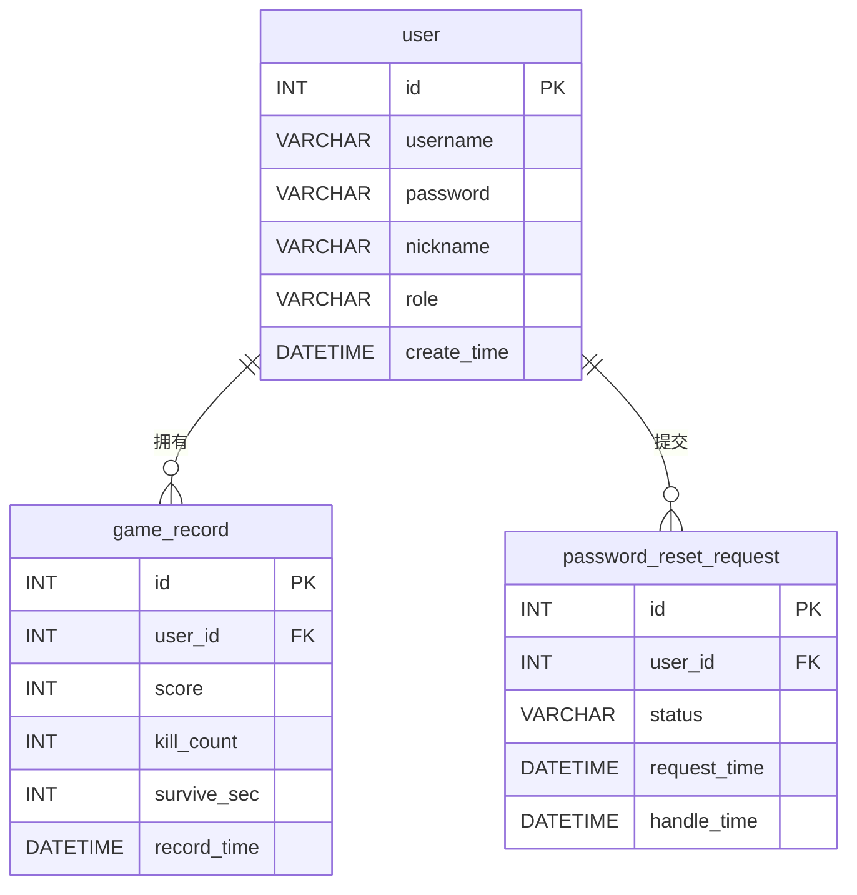

# 数据库设计文档

| 项 | 内容 |
|---|---|
| 项目名称 | 基于 Java 的 2D 射击类小游戏（打僵尸） |
| 数据库 | MySQL 8.x |
| 库名 | `game_db` |
| 字符集 | `utf8mb4` / `utf8mb4_unicode_ci` |
| 文档版本 | V1.0 |
| 编写日期 | 2026-07-09 |
| 对应脚本 | [sql/schema.sql](../sql/schema.sql) |

---

## 1. 数据库概述

本系统只需一个数据库 `game_db`，共 **3 张表**：

- `user`：用户表，存账号信息（含角色 `role`）。
- `game_record`：游戏记录表，存每次游戏的战绩，通过外键关联到 `user`。
- `password_reset_request`：密码重置申请表，存"忘记密码"的申请记录，通过外键关联到 `user`。

`user` 与 `game_record`、`user` 与 `password_reset_request` 都是经典的**一对多**关系：一个用户可以有多条游戏记录，也可以有多条密码重置申请记录。

> 字符集统一用 `utf8mb4`，保证中文昵称、特殊字符正常存储，避免乱码。存储引擎用 `InnoDB`（支持外键与事务）。

---

## 2. 概念设计（ER 图）



**实体与关系说明**

- **user（用户）** 与 **game_record（游戏记录）** 之间是 `1 : N`（一对多）。一个用户（`user.id`）可以拥有 0 条或多条游戏记录（`game_record.user_id`），实现方式是在 `game_record` 中加外键 `user_id` 指向 `user.id`。
- **user（用户）** 与 **password_reset_request（密码重置申请）** 之间也是 `1 : N`（一对多）。一个用户可以提交多条重置申请记录（一个用户可有多条历史申请），实现方式是在 `password_reset_request` 中加外键 `user_id` 指向 `user.id`。

---

## 3. 逻辑设计（表结构）

### 3.1 user（用户表）

| 字段 | 类型 | 约束 | 默认值 | 说明 |
|---|---|---|---|---|
| `id` | INT | PRIMARY KEY, AUTO_INCREMENT | — | 用户ID，主键 |
| `username` | VARCHAR(50) | NOT NULL, UNIQUE | — | 登录用户名，全局唯一 |
| `password` | VARCHAR(64) | NOT NULL | — | 密码，存 MD5 值（32 位），故长度 64 足够 |
| `nickname` | VARCHAR(50) | 可空 | NULL | 昵称，显示用 |
| `role` | VARCHAR(10) | NOT NULL | 'user' | 角色：`admin`（管理员）/ `user`（普通用户） |
| `create_time` | DATETIME | NOT NULL | CURRENT_TIMESTAMP | 注册时间 |

- **主键**：`id`
- **唯一键**：`uk_username (username)` —— 用户名不能重复

### 3.2 game_record（游戏记录表）

| 字段 | 类型 | 约束 | 默认值 | 说明 |
|---|---|---|---|---|
| `id` | INT | PRIMARY KEY, AUTO_INCREMENT | — | 记录ID，主键 |
| `user_id` | INT | NOT NULL, FOREIGN KEY | — | 所属用户ID，外键→`user.id` |
| `score` | INT | NOT NULL | 0 | 本局得分 |
| `kill_count` | INT | NOT NULL | 0 | 本局击杀数 |
| `survive_sec` | INT | NOT NULL | 0 | 存活秒数 |
| `record_time` | DATETIME | NOT NULL | CURRENT_TIMESTAMP | 记录时间 |

- **主键**：`id`
- **外键**：`fk_record_user (user_id) → user(id)`
- **索引**：`idx_user (user_id)` —— 按"我的记录"查询用；`idx_score (score)` —— 排行榜按分数排序用

### 3.3 password_reset_request（密码重置申请表）

| 字段 | 类型 | 约束 | 默认值 | 说明 |
|---|---|---|---|---|
| `id` | INT | PRIMARY KEY, AUTO_INCREMENT | — | 申请ID，主键 |
| `user_id` | INT | NOT NULL, FOREIGN KEY | — | 申请用户ID，外键→`user.id` |
| `status` | VARCHAR(10) | NOT NULL | 'pending' | 审核状态：`pending`（待审核）/ `approved`（已通过）/ `rejected`（已拒绝） |
| `request_time` | DATETIME | NOT NULL | CURRENT_TIMESTAMP | 申请时间 |
| `handle_time` | DATETIME | 可空 | NULL | 处理时间，管理员通过/拒绝时写入 |

- **主键**：`id`
- **外键**：`fk_reset_user (user_id) → user(id)`
- **索引**：`idx_reset_user (user_id)` —— 按用户查申请用；`idx_reset_status (status)` —— 按 `pending` 查待审核列表用
- **防重复 pending**：由应用层（`ResetRequestDao`）保证——提交前先 `hasPending` 检查，同一用户已存在 `pending` 申请则不再创建。不在数据库加唯一约束，因为一个用户允许有多条已处理（approved/rejected）的历史记录。

---

## 4. 关系与约束汇总

| 约束类型 | 名称 | 作用于 | 说明 |
|---|---|---|---|
| 主键 | `PRIMARY` | `user.id` | 用户唯一标识 |
| 主键 | `PRIMARY` | `game_record.id` | 记录唯一标识 |
| 主键 | `PRIMARY` | `password_reset_request.id` | 申请唯一标识 |
| 唯一键 | `uk_username` | `user.username` | 用户名不可重复 |
| 非空+默认值 | NOT NULL DEFAULT 'user' | `user.role` | 角色取值 `admin`/`user`，默认 `user` |
| 非空+默认值 | NOT NULL DEFAULT 'pending' | `password_reset_request.status` | 状态取值 `pending`/`approved`/`rejected`，默认 `pending` |
| 外键 | `fk_record_user` | `game_record.user_id → user.id` | 战绩必须属于某个存在的用户 |
| 外键 | `fk_reset_user` | `password_reset_request.user_id → user.id` | 申请必须属于某个存在的用户（user 1 — N password_reset_request） |
| 索引 | `idx_user` | `game_record.user_id` | 加速"某用户的记录"查询 |
| 索引 | `idx_score` | `game_record.score` | 加速排行榜按分数排序 |
| 索引 | `idx_reset_user` | `password_reset_request.user_id` | 加速"某用户的申请"查询 |
| 索引 | `idx_reset_status` | `password_reset_request.status` | 加速"待审核（pending）列表"查询 |
| 业务约束（应用层） | — | `password_reset_request` | 同一用户已有 `pending` 申请时不可再提（由 `ResetRequestDao.hasPending` 保证） |
| 业务约束（应用层） | — | `user` / `password_reset_request` | `admin` 账号不可被删除、不可被重置（保护超级账号，由 DAO 层判断） |
| 非空 | NOT NULL | 各核心字段 | `username/password/role/user_id/score/status` 等不能为空 |

---

## 5. 数据字典

### 5.1 user 表

| 字段 | 数据类型 | 长度 | 是否必填 | 是否唯一 | 业务含义 | 取值范围/规则 |
|---|---|---|---|---|---|---|
| id | INT | — | 是 | 是 | 用户主键 | 自增，正整数 |
| username | VARCHAR | 50 | 是 | 是 | 登录名 | 字母/数字/下划线，建议 ≤20 |
| password | VARCHAR | 64 | 是 | 否 | 登录密码 | 存 MD5（输入明文≥6位） |
| nickname | VARCHAR | 50 | 否 | 否 | 昵称 | 中文/字母数字 |
| role | VARCHAR | 10 | 是 | 否 | 角色 | `admin`（管理员）/ `user`（普通用户），默认 `user` |
| create_time | DATETIME | — | 是 | 否 | 注册时间 | 默认当前时间 |

### 5.2 game_record 表

| 字段 | 数据类型 | 长度 | 是否必填 | 是否唯一 | 业务含义 | 取值范围/规则 |
|---|---|---|---|---|---|---|
| id | INT | — | 是 | 是 | 记录主键 | 自增，正整数 |
| user_id | INT | — | 是 | 否 | 所属用户 | 必须是 user.id 中已有的值 |
| score | INT | — | 是 | 否 | 本局得分 | ≥ 0 |
| kill_count | INT | — | 是 | 否 | 击杀数 | ≥ 0 |
| survive_sec | INT | — | 是 | 否 | 存活秒数 | ≥ 0 |
| record_time | DATETIME | — | 是 | 否 | 记录时间 | 默认当前时间 |

### 5.3 password_reset_request 表

| 字段 | 数据类型 | 长度 | 是否必填 | 是否唯一 | 业务含义 | 取值范围/规则 |
|---|---|---|---|---|---|---|
| id | INT | — | 是 | 是 | 申请主键 | 自增，正整数 |
| user_id | INT | — | 是 | 否 | 申请用户 | 必须是 user.id 中已有的值 |
| status | VARCHAR | 10 | 是 | 否 | 审核状态 | `pending`/`approved`/`rejected`，默认 `pending` |
| request_time | DATETIME | — | 是 | 否 | 申请时间 | 默认当前时间 |
| handle_time | DATETIME | — | 否 | 否 | 处理时间 | 通过/拒绝时写入，未处理为空 |

> `PasswordResetRequest` 模型另含 `username`、`nickname` 两个仅显示用的字段，由 DAO JOIN `user` 表填充，**不是本表的列**。

---

## 6. 建表脚本

完整、可重复执行的建表脚本见 [sql/schema.sql](../sql/schema.sql)（含建库、建表、外键、索引、测试数据、验证查询）。

脚本要点：
- `CREATE DATABASE IF NOT EXISTS` + `DROP TABLE IF EXISTS`，可反复执行不报错。
- 删表顺序：**先删 `game_record`、`password_reset_request`（有外键），再删 `user`**。
- 密码测试数据统一为 `123456`，存为 `MD5('123456') = e10adc3949ba59abbe56e057f20f883e`。
- `user` 表含 `role` 列：`admin` 行为 `admin`，其余为 `user`；普通用户注册（`UserDao.register`）直接成功，默认 `role='user'`，不需审核。

---

## 7. 测试数据

`schema.sql` 内置如下数据，便于联调与演示：

**user（3 条）**

| id | username | password(MD5) | nickname | role |
|---|---|---|---|---|
| 1 | admin | e10adc…883e（=123456） | 管理员 | admin |
| 2 | player1 | 同上 | 张三 | user |
| 3 | player2 | 同上 | 李四 | user |

**password_reset_request（0 条）**

初始为空，运行期由用户点"忘记密码?"后写入、管理员审核后更新。

**game_record（5 条）**

| user_id | score | kill_count | survive_sec |
|---|---|---|---|
| 1 | 320 | 32 | 210 |
| 2 | 150 | 15 | 120 |
| 3 | 480 | 48 | 305 |
| 2 | 200 | 20 | 150 |
| 3 | 90 | 9 | 60 |

**排行榜预期结果（按分数倒序）**：李四(480) → 管理员(320) → 张三(200) → 张三(150) → 李四(90)。

---

## 8. 典型 SQL（与 DAO 方法对应）

| DAO 方法 | SQL |
|---|---|
| `UserDao.register` | `INSERT INTO user(username,password,nickname) VALUES(?,?,?)`（`role` 取默认值 `user`，普通用户注册直接成功） |
| `UserDao.login` | `SELECT * FROM user WHERE username=? AND password=?` |
| `UserDao.findByName` | `SELECT COUNT(*) FROM user WHERE username=?` |
| `UserDao.changePassword` | `UPDATE user SET password=? WHERE id=? AND password=?`（旧密码 MD5 放 WHERE 校验） |
| `UserDao.listAllUsers` | `SELECT * FROM user ORDER BY id` |
| `UserDao.deleteUser` | `DELETE FROM user WHERE id=?`（`admin` 不可删，由 DAO 层先查 `role` 拦截） |
| `RecordDao.saveRecord` | `INSERT INTO game_record(user_id,score,kill_count,survive_sec) VALUES(?,?,?,?)` |
| `RecordDao.topN` | `SELECT * FROM game_record ORDER BY score DESC LIMIT ?` |
| `RecordDao.mine` | `SELECT * FROM game_record WHERE user_id=? ORDER BY score DESC` |
| `ResetRequestDao.requestReset` | 先 `hasPending`，无 `pending` 时 `INSERT INTO password_reset_request(user_id) VALUES(?)` |
| `ResetRequestDao.hasPending` | `SELECT COUNT(*) FROM password_reset_request WHERE user_id=? AND status='pending'` |
| `ResetRequestDao.listPending` | `SELECT r.*, u.username, u.nickname FROM password_reset_request r JOIN user u ON r.user_id=u.id WHERE r.status='pending' ORDER BY r.request_time` |
| `ResetRequestDao.approve` | `UPDATE user SET password=? WHERE id=?`（重置为 `MD5('123456')`）；`UPDATE password_reset_request SET status='approved', handle_time=NOW() WHERE id=?` |
| `ResetRequestDao.reject` | `UPDATE password_reset_request SET status='rejected', handle_time=NOW() WHERE id=?` |

> 所有 SQL 均使用 `PreparedStatement` 参数化，防止 SQL 注入；密码写入前经 `MD5Util.md5(...)` 处理。审核通过即把该用户密码重置为 `123456`（`MD5('123456') = e10adc3949ba59abbe56e057f20f883e`），`admin` 账号不可被重置。

---

## 附：如何查看本文档中的图

本文档的 ER 图用 Mermaid `erDiagram` 编写。

1. **VS Code**：打开本 `.md` → `Ctrl+Shift+V` 预览，ER 图自动渲染。
2. **导出 PNG**：把 ```` ```mermaid ```` 代码块复制到 [https://mermaid.live](https://mermaid.live) → Actions → PNG 下载。
3. **正式图**：若答辩要求建模工具画的 ER 图，可在 Navicat「逆向工程到模型」、PowerDesigner、或 draw.io 中按本文重画。
