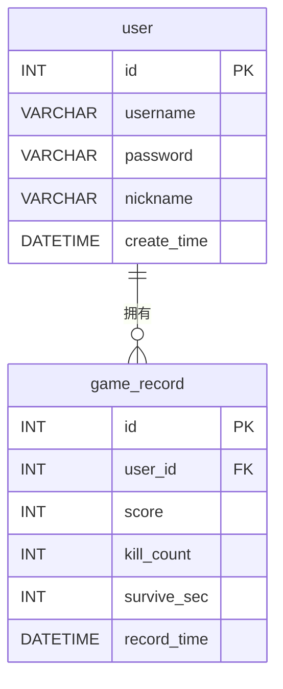

# 数据库设计文档

| 项 | 内容 |
|---|---|
| 项目名称 | 基于 Java 的 2D 射击类小游戏（打僵尸） |
| 数据库 | MySQL 8.x |
| 库名 | `game_db` |
| 字符集 | `utf8mb4` / `utf8mb4_unicode_ci` |
| 文档版本 | V1.0 |
| 编写日期 | 2026-07-09 |
| 对应脚本 | [sql/schema.sql](../sql/schema.sql) |

---

## 1. 数据库概述

本系统只需一个数据库 `game_db`，共 **2 张表**：

- `user`：用户表，存账号信息。
- `game_record`：游戏记录表，存每次游戏的战绩，通过外键关联到 `user`。

两张表是经典的**一对多**关系：一个用户可以有多条游戏记录。

> 字符集统一用 `utf8mb4`，保证中文昵称、特殊字符正常存储，避免乱码。存储引擎用 `InnoDB`（支持外键与事务）。

---

## 2. 概念设计（ER 图）



**实体与关系说明**

- **user（用户）** 与 **game_record（游戏记录）** 之间是 `1 : N`（一对多）。
- 关系含义：一个用户（`user.id`）可以拥有 0 条或多条游戏记录（`game_record.user_id`）。
- 实现方式：在 `game_record` 表中加外键 `user_id` 指向 `user.id`。

---

## 3. 逻辑设计（表结构）

### 3.1 user（用户表）

| 字段 | 类型 | 约束 | 默认值 | 说明 |
|---|---|---|---|---|
| `id` | INT | PRIMARY KEY, AUTO_INCREMENT | — | 用户ID，主键 |
| `username` | VARCHAR(50) | NOT NULL, UNIQUE | — | 登录用户名，全局唯一 |
| `password` | VARCHAR(64) | NOT NULL | — | 密码，存 MD5 值（32 位），故长度 64 足够 |
| `nickname` | VARCHAR(50) | 可空 | NULL | 昵称，显示用 |
| `create_time` | DATETIME | NOT NULL | CURRENT_TIMESTAMP | 注册时间 |

- **主键**：`id`
- **唯一键**：`uk_username (username)` —— 用户名不能重复

### 3.2 game_record（游戏记录表）

| 字段 | 类型 | 约束 | 默认值 | 说明 |
|---|---|---|---|---|
| `id` | INT | PRIMARY KEY, AUTO_INCREMENT | — | 记录ID，主键 |
| `user_id` | INT | NOT NULL, FOREIGN KEY | — | 所属用户ID，外键→`user.id` |
| `score` | INT | NOT NULL | 0 | 本局得分 |
| `kill_count` | INT | NOT NULL | 0 | 本局击杀数 |
| `survive_sec` | INT | NOT NULL | 0 | 存活秒数 |
| `record_time` | DATETIME | NOT NULL | CURRENT_TIMESTAMP | 记录时间 |

- **主键**：`id`
- **外键**：`fk_record_user (user_id) → user(id)`
- **索引**：`idx_user (user_id)` —— 按"我的记录"查询用；`idx_score (score)` —— 排行榜按分数排序用

---

## 4. 关系与约束汇总

| 约束类型 | 名称 | 作用于 | 说明 |
|---|---|---|---|
| 主键 | `PRIMARY` | `user.id` | 用户唯一标识 |
| 主键 | `PRIMARY` | `game_record.id` | 记录唯一标识 |
| 唯一键 | `uk_username` | `user.username` | 用户名不可重复 |
| 外键 | `fk_record_user` | `game_record.user_id → user.id` | 战绩必须属于某个存在的用户 |
| 索引 | `idx_user` | `game_record.user_id` | 加速"某用户的记录"查询 |
| 索引 | `idx_score` | `game_record.score` | 加速排行榜按分数排序 |
| 非空 | NOT NULL | 各核心字段 | `username/password/user_id/score` 等不能为空 |

---

## 5. 数据字典

### 5.1 user 表

| 字段 | 数据类型 | 长度 | 是否必填 | 是否唯一 | 业务含义 | 取值范围/规则 |
|---|---|---|---|---|---|---|
| id | INT | — | 是 | 是 | 用户主键 | 自增，正整数 |
| username | VARCHAR | 50 | 是 | 是 | 登录名 | 字母/数字/下划线，建议 ≤20 |
| password | VARCHAR | 64 | 是 | 否 | 登录密码 | 存 MD5（输入明文≥6位） |
| nickname | VARCHAR | 50 | 否 | 否 | 昵称 | 中文/字母数字 |
| create_time | DATETIME | — | 是 | 否 | 注册时间 | 默认当前时间 |

### 5.2 game_record 表

| 字段 | 数据类型 | 长度 | 是否必填 | 是否唯一 | 业务含义 | 取值范围/规则 |
|---|---|---|---|---|---|---|
| id | INT | — | 是 | 是 | 记录主键 | 自增，正整数 |
| user_id | INT | — | 是 | 否 | 所属用户 | 必须是 user.id 中已有的值 |
| score | INT | — | 是 | 否 | 本局得分 | ≥ 0 |
| kill_count | INT | — | 是 | 否 | 击杀数 | ≥ 0 |
| survive_sec | INT | — | 是 | 否 | 存活秒数 | ≥ 0 |
| record_time | DATETIME | — | 是 | 否 | 记录时间 | 默认当前时间 |

---

## 6. 建表脚本

完整、可重复执行的建表脚本见 [sql/schema.sql](../sql/schema.sql)（含建库、建表、外键、索引、测试数据、验证查询）。

脚本要点：
- `CREATE DATABASE IF NOT EXISTS` + `DROP TABLE IF EXISTS`，可反复执行不报错。
- 删表顺序：**先删 `game_record`（有外键），再删 `user`**。
- 密码测试数据统一为 `123456`，存为 `MD5('123456') = e10adc3949ba59abbe56e057f20f883e`。

---

## 7. 测试数据

`schema.sql` 内置如下数据，便于联调与演示：

**user（3 条）**

| id | username | password(MD5) | nickname |
|---|---|---|---|
| 1 | admin | e10adc…883e（=123456） | 管理员 |
| 2 | player1 | 同上 | 张三 |
| 3 | player2 | 同上 | 李四 |

**game_record（5 条）**

| user_id | score | kill_count | survive_sec |
|---|---|---|---|
| 1 | 320 | 32 | 210 |
| 2 | 150 | 15 | 120 |
| 3 | 480 | 48 | 305 |
| 2 | 200 | 20 | 150 |
| 3 | 90 | 9 | 60 |

**排行榜预期结果（按分数倒序）**：李四(480) → 管理员(320) → 张三(200) → 张三(150) → 李四(90)。

---

## 8. 典型 SQL（与 DAO 方法对应）

| DAO 方法 | SQL |
|---|---|
| `UserDao.register` | `INSERT INTO user(username,password,nickname) VALUES(?,?,?)` |
| `UserDao.login` | `SELECT * FROM user WHERE username=? AND password=?` |
| `UserDao.findByName` | `SELECT COUNT(*) FROM user WHERE username=?` |
| `RecordDao.saveRecord` | `INSERT INTO game_record(user_id,score,kill_count,survive_sec) VALUES(?,?,?,?)` |
| `RecordDao.topN` | `SELECT * FROM game_record ORDER BY score DESC LIMIT ?` |
| `RecordDao.mine` | `SELECT * FROM game_record WHERE user_id=? ORDER BY score DESC` |

> 所有 SQL 均使用 `PreparedStatement` 参数化，防止 SQL 注入；密码写入前经 `MD5Util.md5(...)` 处理。

---

## 附：如何查看本文档中的图

本文档的 ER 图用 Mermaid `erDiagram` 编写。

1. **VS Code**：打开本 `.md` → `Ctrl+Shift+V` 预览，ER 图自动渲染。
2. **导出 PNG**：把 ```` ```mermaid ```` 代码块复制到 [https://mermaid.live](https://mermaid.live) → Actions → PNG 下载。
3. **正式图**：若答辩要求建模工具画的 ER 图，可在 Navicat「逆向工程到模型」、PowerDesigner、或 draw.io 中按本文重画。
