# 详细设计说明书

| 项 | 内容 |
|---|---|
| 项目名称 | 基于 Java 的 2D 射击类小游戏（打僵尸） |
| 文档版本 | V1.0 |
| 编写日期 | 2026-07-09 |
| 适用阶段 | 课程设计 阶段①（需求与设计） |

---

## 1. 引言

### 1.1 编写目的
在《需求规格说明书》基础上，从**系统结构、类设计、流程、界面**四个层面说明"怎么做"。它是编码的直接依据。

### 1.2 设计原则
- **分层**：UI 层 / 游戏层 / 数据层，层间单向依赖，降低耦合。
- **面向对象**：用接口 `GameObject` 抽象游戏对象，体现封装、继承、多态。
- **单一职责**：每个类只做一件事（窗体只管界面、DAO 只管数据库、Controller 只管游戏流程）。

---

## 2. 系统总体设计

### 2.1 总体结构图

系统分为三层，自上而下调用；数据层通过 JDBC 访问 MySQL。

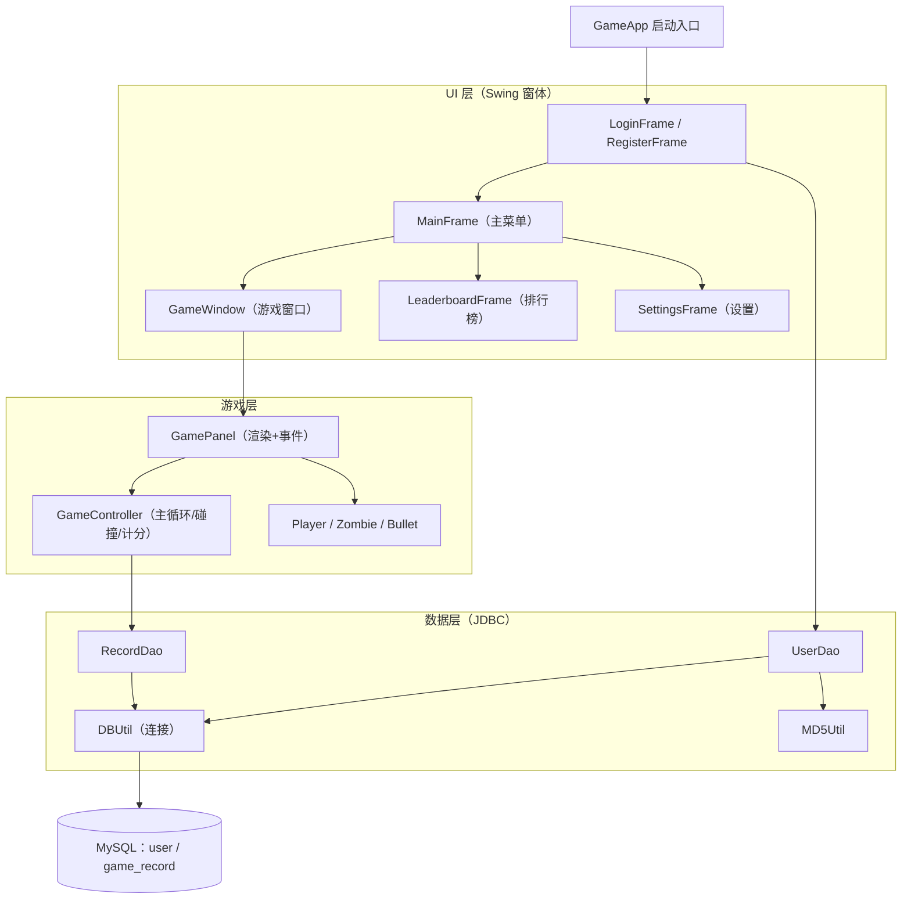

### 2.2 模块划分

| 模块 | 主要类 | 职责 |
|---|---|---|
| 启动 | `GameApp` | 程序入口，设置界面外观，打开登录窗 |
| 用户 | `LoginFrame` / `RegisterFrame` | 注册、登录 |
| 菜单 | `MainFrame` | 主菜单与功能跳转 |
| 游戏 | `GameWindow` / `GamePanel` / `GameController` / `Player` / `Zombie` / `Bullet` | 核心玩法 |
| 排行榜 | `LeaderboardFrame` | 查询并展示战绩 |
| 数据 | `DBUtil` / `UserDao` / `RecordDao` / `MD5Util` | 封装所有数据库操作 |

---

## 3. 类设计（UML 类图）

### 3.1 类图

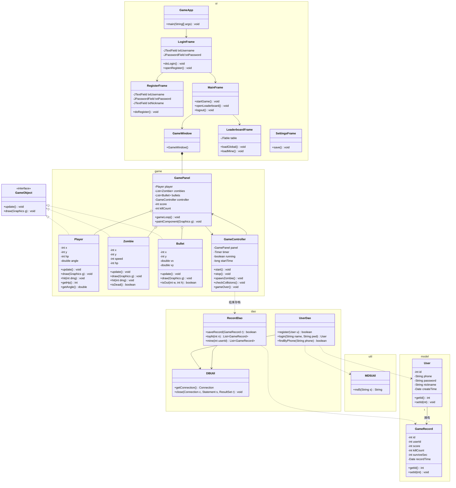

### 3.2 类间关系说明

| 关系 | 含义 |
|---|---|
| `Player / Zombie / Bullet ──实现──▶ GameObject` | 三个游戏对象都实现 `GameObject` 接口，体现**多态**：`GamePanel` 可统一管理、统一调用 `update()/draw()` |
| `GamePanel ──聚合──▶ Player/Zombie/Bullet` | 面板持有玩家、僵尸列表、子弹列表（整体与部分，部分可独立） |
| `GamePanel ⟷ GameController` | 面板负责渲染与事件，控制器负责逻辑；互相引用 |
| `GameController ──依赖──▶ RecordDao` | 游戏结束时调用 DAO 存档 |
| `UserDao/RecordDao ──依赖──▶ DBUtil` | 所有 DAO 通过 `DBUtil` 获取连接 |
| `UserDao ──依赖──▶ MD5Util` | 注册/登录时对密码做 MD5 |
| `User 1 ──拥有── * GameRecord` | 一个用户有多条战绩，**一对多**，外键 `user_id` |
| `GameWindow ──组合──▶ GamePanel` | 窗口由面板构成（强生命周期） |

### 3.3 关键类职责

| 类 | 一句话职责 |
|---|---|
| `GameApp` | 程序入口，初始化界面主题并显示登录窗 |
| `LoginFrame` / `RegisterFrame` | 登录与注册界面，调用 `UserDao` 完成校验/写入 |
| `MainFrame` | 主菜单，跳转到游戏/排行榜/设置 |
| `GameWindow` | 游戏窗口（JFrame），承载 `GamePanel` |
| `GamePanel` | 游戏画面（JPanel）：渲染所有对象、响应鼠标 |
| `GameController` | 游戏主循环：刷怪、移动、碰撞、计分、结束 |
| `Player` | 玩家：位置、血量、枪口角度、绘制 |
| `Zombie` | 敌人：位置、速度、血量，向玩家移动 |
| `Bullet` | 子弹：位置、速度向量，飞行与出界判断 |
| `LeaderboardFrame` | 排行榜界面，调用 `RecordDao` 展示战绩 |
| `User` / `GameRecord` | 实体（POJO），对应数据库两表 |
| `DBUtil` | JDBC 连接获取与资源释放 |
| `UserDao` / `RecordDao` | 用户与战绩的增删改查 |
| `MD5Util` | 密码 MD5 加密 |

---

## 4. 关键流程设计

### 4.1 登录流程

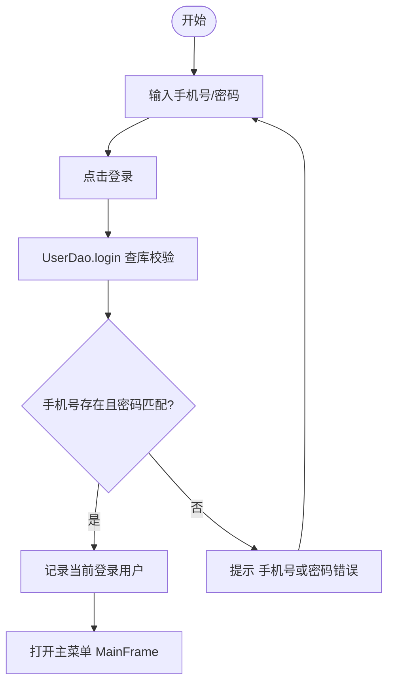

### 4.2 游戏主循环流程

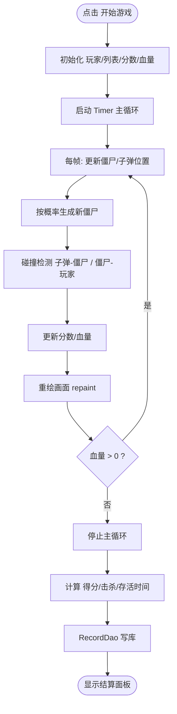

### 4.3 射击与碰撞判定流程

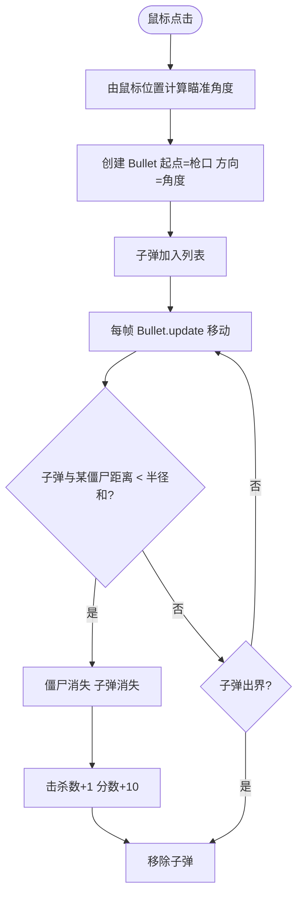

### 4.4 排行榜流程

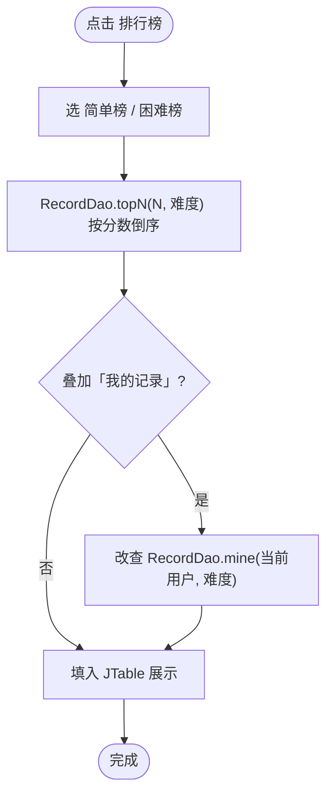

### 4.5 时序图：登录

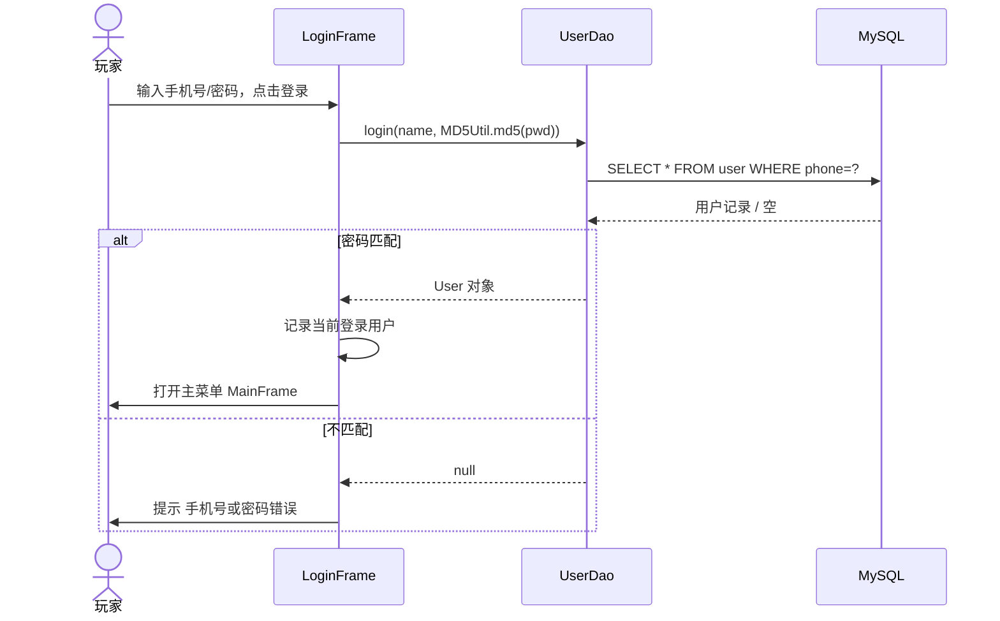

### 4.6 时序图：游戏结束存档

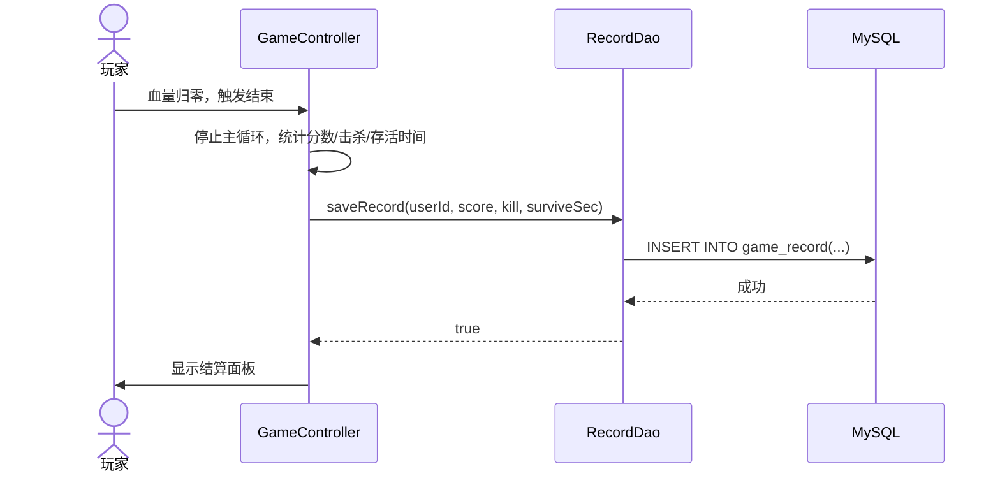

---

## 5. 界面设计

| 界面 | 主要元素 | 布局/交互 |
|---|---|---|
| 登录界面 | 手机号框、密码框、登录按钮、去注册 | 卡通背景，居中卡片；回车可登录 |
| 注册界面 | 手机号、密码、昵称、注册按钮、返回 | 输入校验提示（手机号格式 / 重复） |
| 主菜单 | 开始游戏 / 排行榜 / 游戏说明 / 设置 / 退出 | 大按钮纵排 + 游戏背景 |
| 游戏界面 | 游戏画布 + 顶部 HUD（分数/血量/击杀/时间） | 鼠标瞄准点击射击 |
| 结算界面 | 分数/击杀/用时 + 再来一局/排行榜/主菜单 | 游戏结束弹出对话框 |
| 排行榜界面 | JTable：排名/昵称/分数/击杀/用时/日期 + 切换按钮 | 简单榜 / 困难榜可切换，可叠加「我的记录」 |

---

## 6. 游戏数值设计（建议初始值，可调）

| 参数 | 初始值 | 说明 |
|---|---|---|
| 玩家血量 | 100 | 被僵尸碰到 −20 |
| 子弹速度 | 8 px/帧 | 沿瞄准方向飞行 |
| 僵尸速度 | 1~2 px/帧 | 向玩家直线移动 |
| 刷怪间隔 | 约 1.5~2 秒 | 难度提升时缩短 |
| 击杀得分 | +10 | 可按难度调整 |
| 游戏区大小 | 800×600 | 固定 |
| 帧间隔 | 约 16~33ms（Timer） | 对应 30~60 FPS |

---

## 扩展模块：用户管理与账号安全（设计）

> 本节为扩展内容，在原有"登录 / 注册"基础上新增**角色权限（admin / user）、忘记密码重置申请、修改密码、用户管理**。原有章节不变，仅作补充。

### E.1 设计决策（默认值）

| 序号 | 决策 | 说明 |
|---|---|---|
| 1 | admin 权限范围 | 查看所有用户 + 审核重置申请（通过 → 重置 `123456` / 拒绝）+ 删除用户 |
| 2 | 重置申请去重 | 同一用户已有 `pending` 申请时不能再提，避免堆积；处理完（`approved` / `rejected`）才能再提 |
| 3 | 超级账号保护 | `admin` 账号**不可被删除、不可被重置** |
| — | 注册策略不变 | 普通用户注册直接成功，`role='user'`，**不需审核** |

> `admin` 账号 `role='admin'`，其余注册用户 `role='user'`。

### E.2 数据库补充

- `user` 表新增列：`role VARCHAR(10) NOT NULL DEFAULT 'user'`（取值 `admin` / `user`）。
- 新增表 `password_reset_request`，与 `user` 为 `1 : N`（一个用户可有多条重置申请记录）：

| 字段 | 类型 | 约束 / 默认 | 说明 |
|---|---|---|---|
| `id` | INT | PK, AUTO_INCREMENT | 申请ID |
| `user_id` | INT | NOT NULL, FK → `user.id` | 申请人 |
| `status` | VARCHAR(10) | NOT NULL DEFAULT `'pending'` | `pending` / `approved` / `rejected` |
| `request_time` | DATETIME | NOT NULL DEFAULT `CURRENT_TIMESTAMP` | 申请时间 |
| `handle_time` | DATETIME | NULL | 处理时间 |

### E.3 UML 类图补充

> 下图仅画出本模块**新增 / 变更**的类与关系，其余类同 3.1 节。

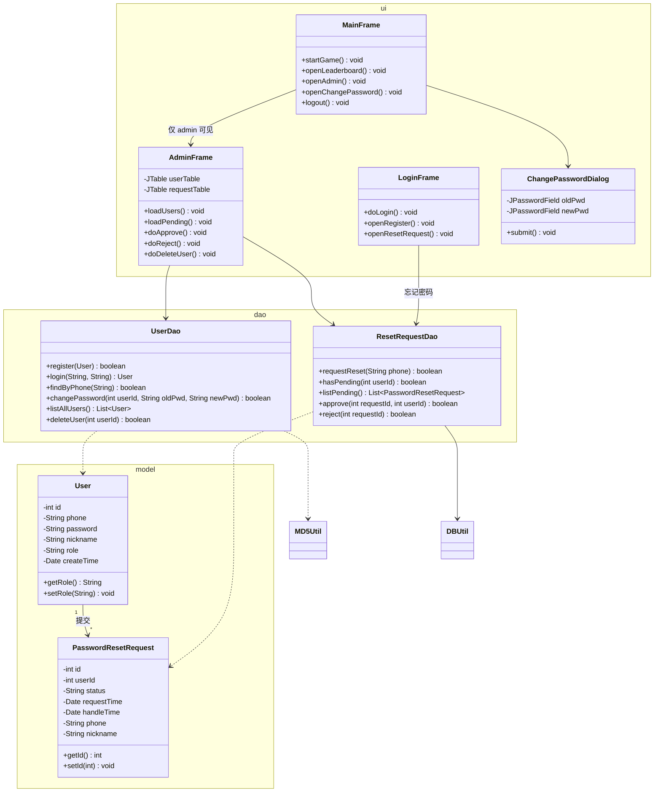

> 说明：`PasswordResetRequest` 中的 `phone / nickname` 为**仅显示用字段**，由 `ResetRequestDao.listPending()` 通过 JOIN `user` 表填充，**不是 `password_reset_request` 表的真实列**。

#### 类间关系补充说明

| 关系 | 含义 |
|---|---|
| `User 1 ──提交── * PasswordResetRequest` | 一个用户可有多条重置申请记录，**一对多**，外键 `user_id` |
| `MainFrame ──仅 admin 可见──▶ AdminFrame` | "用户管理"按钮仅当 `currentUser.getRole()=="admin"` 时显示 |
| `AdminFrame ──依赖──▶ UserDao / ResetRequestDao` | 管理界面调用两个 DAO 完成查询 / 审核 / 删除 |
| `LoginFrame ──依赖──▶ ResetRequestDao` | 忘记密码入口直接调用 `requestReset` 提交申请 |

### E.4 关键流程图

#### E.4.1 忘记密码申请

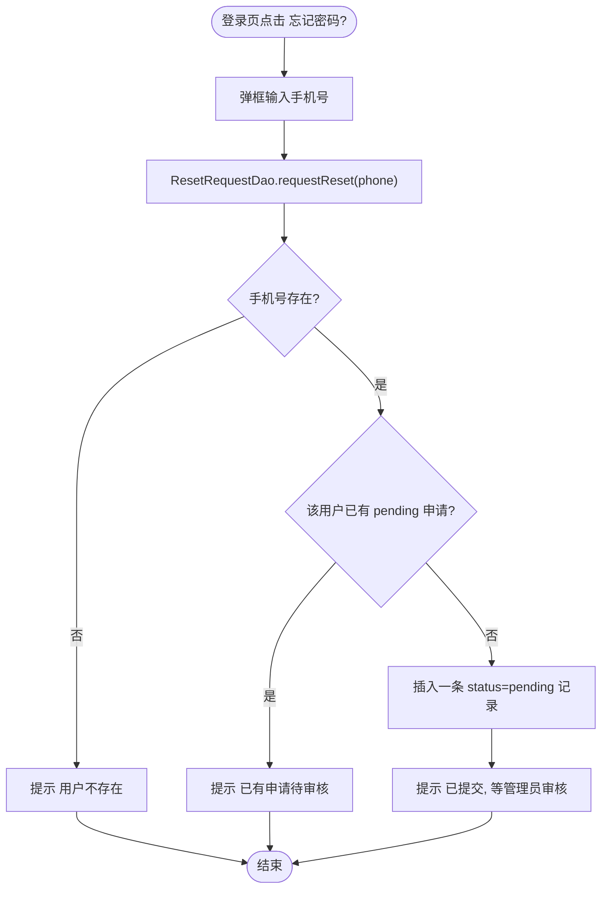

#### E.4.2 管理员审核重置（通过 → 重置 123456）

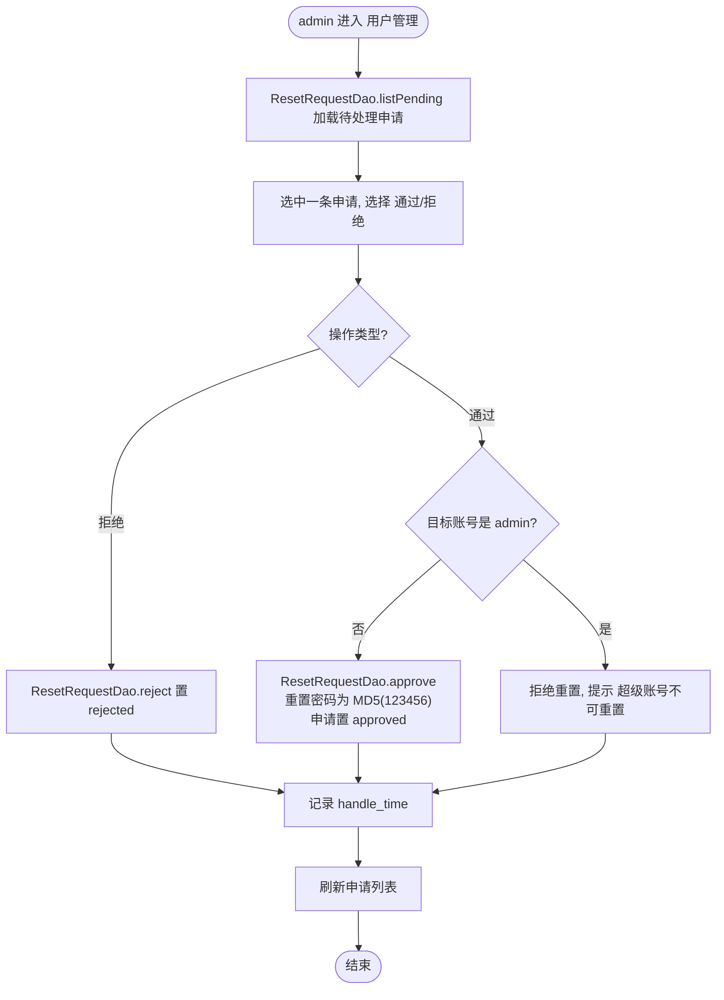

#### E.4.3 修改密码（校验旧密码）

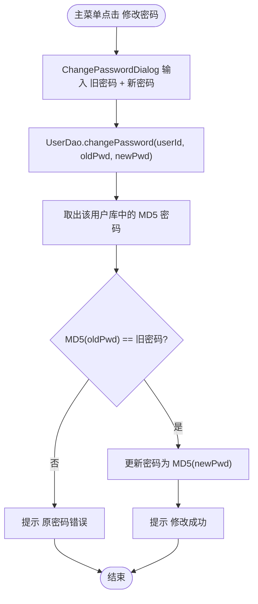

### E.5 界面设计补充

| 界面 | 主要元素 | 布局 / 交互 | 备注 |
|---|---|---|---|
| 登录界面（补充） | 新增 **"忘记密码?"** 按钮 | 点击弹框输入手机号 → 调 `ResetRequestDao.requestReset` → 提示"已提交，等管理员审核" | 所有用户可见 |
| 主菜单（补充） | 新增 **修改密码** 按钮；**用户管理** 按钮（仅 admin） | 与现有大按钮纵排 | 用户管理按钮在非 admin 登录时**不显示** |
| AdminFrame（用户管理） | 上方 `JTable`：所有用户（id / 手机号 / 昵称 / 角色 / 注册时间）；下方 `JTable`：待处理重置申请（手机号 / 申请时间）；按钮：**通过 / 拒绝 / 删除用户** | 双表纵排，操作按钮置于下方 | admin 专用 |
| ChangePasswordDialog（修改密码） | 旧密码框 + 新密码框 + 确认按钮 | 模态对话框 | 后端校验旧密码，失败提示 |

### E.6 新增类职责说明

| 类 | 一句话职责 |
|---|---|
| `PasswordResetRequest` | 重置申请实体（POJO），对应 `password_reset_request` 表；附带显示用 `phone / nickname` |
| `ResetRequestDao` | 重置申请的数据访问：申请、查重、列出待审、通过（重置 `123456`）、拒绝 |
| `AdminFrame` | 管理员界面：展示用户表与待审申请表，执行通过 / 拒绝 / 删除用户 |
| `ChangePasswordDialog` | 修改密码对话框：校验旧密码后提交新密码 |

> 附带变更：`User` 新增 `role` 字段及 getter/setter；`UserDao` 新增 `changePassword / listAllUsers / deleteUser`；`MainFrame` 新增"用户管理（仅 admin）/ 修改密码"按钮；`LoginFrame` 新增"忘记密码?"入口。

---

## 附：如何查看本文档中的图

本文档所有图用 Mermaid 语法编写。查看方式：

1. **VS Code**：打开本 `.md` → `Ctrl+Shift+V` 预览，Mermaid 自动渲染。
2. **导出 PNG**：把某个 ```` ```mermaid ```` 代码块复制到 [https://mermaid.live](https://mermaid.live) → Actions → PNG 下载，贴进 Word / 答辩 PPT。
3. **正式图**：若答辩要求"用建模工具画的图"，可在 StarUML 中按本文类图重画类图、在 draw.io/Visio 中重画流程图——本文图可作为对照底稿。
