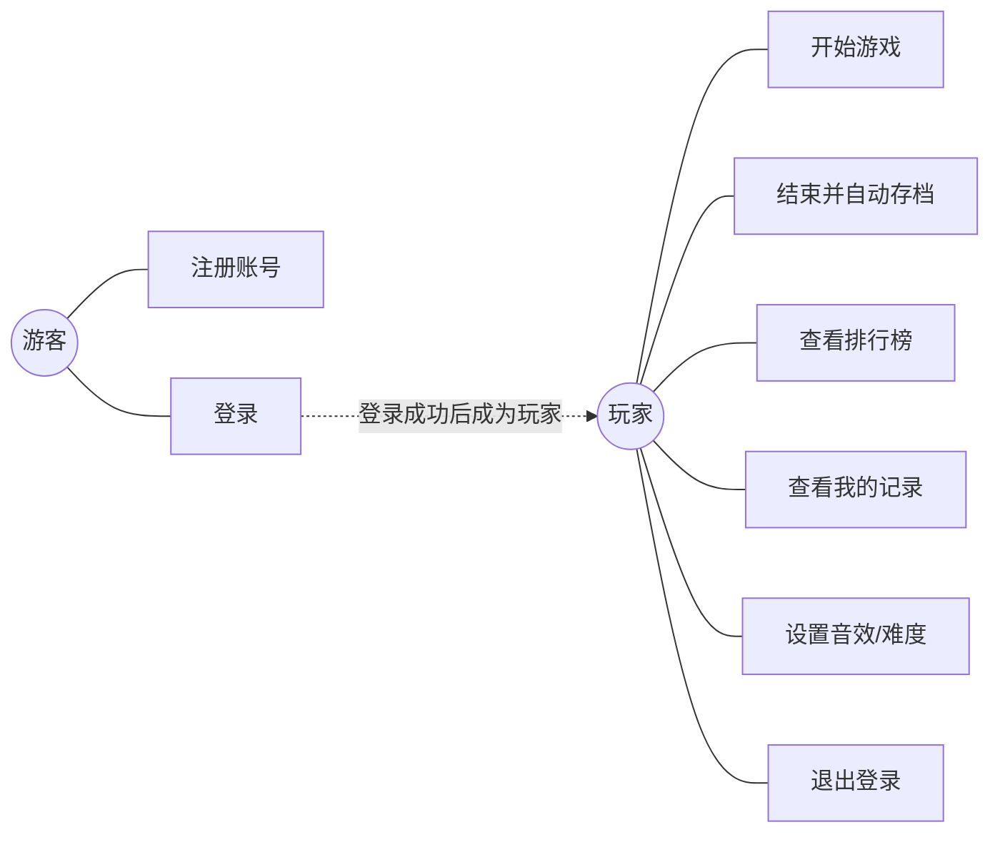
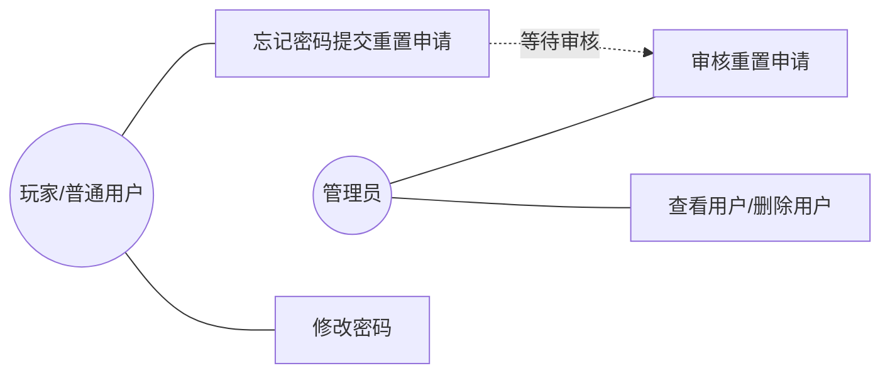

# 需求规格说明书

| 项 | 内容 |
|---|---|
| 项目名称 | 基于 Java 的 2D 射击类小游戏（打僵尸） |
| 文档版本 | V1.0 |
| 编写日期 | 2026-07-09 |
| 适用阶段 | 课程设计 阶段①（需求与设计） |

---

## 1. 引言

### 1.1 编写目的
本文档从**使用者**和**系统**两个角度，明确本项目"要做什么、要做到什么程度"。它是后续详细设计、编码、测试的依据。

### 1.2 项目范围
本项目是一个**单机 2D 射击小游戏**，玩家用鼠标瞄准并射击不断涌来的僵尸，获得分数；游戏带有账号登录、主菜单和基于数据库的排行榜。系统覆盖"Java 程序设计"（界面、游戏逻辑、面向对象）与"数据库原理与应用"（建表、增删改查、外键关联）两方面知识。

### 1.3 术语

| 术语 | 含义 |
|---|---|
| 玩家 | 通过登录进入系统、操作游戏的人 |
| 僵尸 | 游戏中的敌人角色，向玩家移动 |
| 子弹 | 玩家发射的攻击物，命中僵尸可消灭之 |
| HUD | 游戏画面上显示分数/血量/击杀数等信息的状态栏 |
| 战绩 | 一次游戏结束后的得分、击杀数、存活时间等记录 |
| FPS | 每秒画面刷新帧数 |

### 1.4 运行环境
- 操作系统：Windows 10 / 11
- 运行环境：JDK 8 或以上
- 数据库：MySQL 8.x
- 外部依赖：MySQL JDBC 驱动（`mysql-connector-j`）

---

## 2. 项目概述

### 2.1 项目背景
参考原型为一款 Scratch 卡通射击小游戏（橙色猫持枪、绿色僵尸、鼠标瞄准）。本项目用 Java 重写并扩展，增加账号体系与数据库排行榜，使其同时满足 Java 课设与数据库课设的要求。

### 2.2 项目目标
1. 实现一个**可玩**的 2D 射击游戏（瞄准、射击、刷怪、计分、生命值）。
2. 提供**登录 / 注册 / 主菜单 / 排行榜**等完整界面。
3. 用 MySQL 持久化**用户**与**战绩**，支持排行榜查询。
4. 代码符合面向对象设计，文档齐全，可作为课设交付与答辩。

---

## 3. 用户角色

| 角色 | 说明 | 主要操作 |
|---|---|---|
| 游客 | 未登录的访客 | 注册账号、登录 |
| 玩家 | 已登录的用户 | 开始游戏、查看排行榜、查看自己的战绩、退出登录 |

> （基础课设范围无管理员角色；管理员角色 admin 由扩展模块 E.1 引入）

---

## 4. 功能需求

功能按 5 个模块组织，沿用统一编号 `F<模块号>.<序号>`。

### 4.1 F1 用户模块

| 编号 | 功能 | 说明 |
|---|---|---|
| F1.1 | 注册 | 输入手机号、密码、昵称；手机号不能重复（11 位）；密码不少于 6 位 |
| F1.2 | 登录 | 输入手机号、密码，校验通过进入主菜单 |
| F1.3 | 退出登录 | 从主菜单/游戏返回登录界面 |

### 4.2 F2 主菜单模块

| 编号 | 功能 | 说明 |
|---|---|---|
| F2.1 | 开始游戏 | 进入游戏界面 |
| F2.2 | 查看排行榜 | 打开排行榜界面 |
| F2.3 | 游戏说明 | 弹出玩法说明 |
| F2.4 | 设置 | 切换音效开关 / 难度 |
| F2.5 | 退出 | 关闭程序 |

### 4.3 F3 游戏模块（核心）

| 编号 | 功能 | 说明 |
|---|---|---|
| F3.1 | 角色控制 | 玩家角色跟随鼠标方向转动枪口 |
| F3.2 | 射击 | 鼠标点击发射子弹，沿瞄准方向飞行 |
| F3.3 | 刷怪 | 僵尸按时间间隔从边缘随机生成，向玩家移动 |
| F3.4 | 命中判定 | 子弹击中僵尸：僵尸消失、击杀数 +1、得分 +10 |
| F3.5 | 受伤判定 | 僵尸碰到玩家：血量 −20 |
| F3.6 | HUD 显示 | 实时显示得分、击杀数、血量、游戏时间 |
| F3.7 | 结束结算 | 血量归零 → 游戏结束，显示结算面板 |
| F3.8 | 成绩存档 | 结算时把得分/击杀/存活时间写入数据库 |

### 4.4 F4 排行榜模块

| 编号 | 功能 | 说明 |
|---|---|---|
| F4.1 | 简单榜 | 按分数倒序展示简单难度的前 N 名（昵称/分数/击杀/用时/日期） |
| F4.2 | 困难榜 | 按分数倒序展示困难难度的前 N 名 |
| F4.3 | 我的记录 | 在当前难度榜上叠加「只看自己」，看当前登录用户的战绩 |

### 4.5 F5 数据管理（后台）

| 编号 | 功能 | 对应 SQL |
|---|---|---|
| F5.1 | 注册写库 | INSERT user |
| F5.2 | 登录查库 | SELECT user |
| F5.3 | 成绩写库 | INSERT game_record |
| F5.4 | 排行榜查库 | SELECT game_record ORDER BY score |

---

## 5. 用例图

> Mermaid 没有原生"用例图"，下图用流程图近似表示：玩家与各用例的关系。



---

## 6. 用例描述（核心用例）

### UC-01 注册

| 项 | 内容 |
|---|---|
| 用例编号 | UC-01 |
| 名称 | 注册账号 |
| 参与者 | 游客 |
| 前置条件 | 手机号未被注册 |
| 主流程 | 1) 游客填写手机号/密码/昵称 → 2) 系统校验手机号是否已存在 → 3) 不存在则写入 `user` 表 → 4) 提示注册成功，返回登录界面 |
| 异常流 | 手机号已存在：提示"手机号已被注册"；密码不足 6 位：提示"密码至少 6 位"；数据库异常：提示"注册失败，请重试" |
| 后置条件 | `user` 表新增一条记录，密码以 MD5 存储 |

### UC-02 登录

| 项 | 内容 |
|---|---|
| 用例编号 | UC-02 |
| 名称 | 登录 |
| 参与者 | 游客 |
| 前置条件 | 已注册账号 |
| 主流程 | 1) 输入手机号/密码 → 2) 系统按手机号查询 `user` 表 → 3) 比对密码（MD5） → 4) 一致则打开主菜单 |
| 异常流 | 手机号不存在 / 密码错误：提示"手机号或密码错误"；数据库异常：提示"登录失败" |
| 后置条件 | 进入主菜单，当前会话记录登录用户 |

### UC-03 开始游戏

| 项 | 内容 |
|---|---|
| 用例编号 | UC-03 |
| 名称 | 开始游戏 |
| 参与者 | 玩家 |
| 前置条件 | 已登录 |
| 主流程 | 1) 在主菜单点击"开始游戏" → 2) 初始化玩家/血量/分数/僵尸列表 → 3) 启动游戏主循环（定时器） → 4) 玩家瞄准射击消灭僵尸得分 |
| 异常流 | （正常运行无需异常处理） |
| 后置条件 | 血量归零时进入 UC-04 |

### UC-04 结束并自动存档

| 项 | 内容 |
|---|---|
| 用例编号 | UC-04 |
| 名称 | 结束并自动存档 |
| 参与者 | 玩家 |
| 前置条件 | 游戏进行中且血量归零 |
| 主流程 | 1) 停止主循环 → 2) 计算得分/击杀/存活时间 → 3) 写入 `game_record` 表 → 4) 显示结算面板（可：再来一局 / 看排行榜 / 回主菜单） |
| 异常流 | 存档失败：提示"成绩保存失败"，但结算仍正常显示 |
| 后置条件 | `game_record` 新增一条记录 |

### UC-05 查看排行榜

| 项 | 内容 |
|---|---|
| 用例编号 | UC-05 |
| 名称 | 查看排行榜 |
| 参与者 | 玩家 |
| 前置条件 | 已登录 |
| 主流程 | 1) 点击"排行榜" → 2) 选择"简单榜"或"困难榜"（可再叠加"我的记录"只看自己） → 3) 查询 `game_record` 并按分数倒序 → 4) 表格展示结果 |
| 异常流 | 数据库异常：提示"加载失败" |
| 后置条件 | 无 |

---

## 7. 非功能需求

| 类别 | 要求 |
|---|---|
| 性能 | 游戏画面稳定在 30~60 FPS（定时器约 16~33ms 一帧），无明显卡顿 |
| 可用性 | 界面卡通友好，鼠标为主、键盘为辅；操作不超过 2 步即可进入游戏 |
| 健壮性 | 数据库连不上、输入非法时不崩溃，给出友好提示 |
| 安全性 | 密码以 MD5 存储，不存明文 |
| 可维护性 | 分层（UI / 游戏 / 数据）清晰，类职责单一，注释充分 |
| 编码规范 | 4 空格缩进（锯齿型书写格式）、K&R 花括号、统一命名 |

---

## 8. 假设与约束

- **假设**：本机已安装 MySQL 并可连接；JDBC 驱动已加入项目。
- **约束**：
  - 单机运行，不联网对战。
  - 数据库限定在课程允许范围内（本项目用 MySQL）。
  - 素材可用简单图形（圆/三角）占位，后期可替换为图片。

---

## 扩展模块：用户管理与账号安全（账号安全增强）

> 本模块为系统**扩展**，在原有登录 / 注册 / 游戏 / 排行榜之上增加**角色权限**与**账号安全**能力。原有功能不受影响，原有章节内容保持不变。

### E.1 用户角色

| 角色 | `role` 取值 | 说明 | 主要操作 |
|---|---|---|---|
| 普通用户 | `user` | 注册即获得，绝大多数账号属于此类 | 游戏、查看排行榜、修改自己的密码、提交忘记密码申请 |
| 管理员 | `admin` | 超级账号，预置在数据库中 | 普通用户的全部操作 + 查看所有用户 + 审核重置申请 + 删除用户 |

> **注册规则不变**：普通用户注册**直接成功**，`role` 默认为 `user`，**不需要管理员审核**——此规则与原系统一致，本模块不改变。

### E.2 功能需求

沿用统一编号 `F<模块号>.<序号>`，本扩展新增 F6、F7 两个模块。

#### E.2.1 F6 用户管理（管理员）

| 编号 | 功能 | 说明 |
|---|---|---|
| F6.1 | 查看所有用户 | 管理员打开用户管理界面，表格列出全部用户（ID / 手机号 / 昵称 / 角色 / 注册时间） |
| F6.2 | 查看待处理申请 | 下方表格列出 pending 状态的重置申请（手机号 / 申请时间） |
| F6.3 | 审核通过并重置 | 通过申请时，把该用户密码重置为 `MD5("123456")`，申请置为 approved |
| F6.4 | 拒绝申请 | 将申请置为 rejected |
| F6.5 | 删除用户 | 删除指定用户（管理员账号不可删除） |

#### E.2.2 F7 账号安全（所有用户）

| 编号 | 功能 | 说明 |
|---|---|---|
| F7.1 | 忘记密码申请 | 在登录界面提交重置申请（输入手机号），等待管理员审核 |
| F7.2 | 修改密码 | 登录后输入旧密码 + 新密码，校验旧密码正确后改为新密码（均以 MD5 存储） |
| F7.3 | 重置后登录 | 管理员通过申请后，用户用默认密码 `123456` 登录，再自行修改 |

### E.3 数据模型（本模块涉及）

- `user` 表新增列：`role VARCHAR(10) NOT NULL DEFAULT 'user'`（取值 `admin` / `user`）。
- 新增表 `password_reset_request`：

| 列名 | 类型 | 说明 |
|---|---|---|
| id | INT PK AUTO_INCREMENT | 申请 ID |
| user_id | INT NOT NULL，FK→user.id | 申请人 |
| status | VARCHAR(10) NOT NULL DEFAULT 'pending' | pending / approved / rejected |
| request_time | DATETIME NOT NULL DEFAULT CURRENT_TIMESTAMP | 申请时间 |
| handle_time | DATETIME NULL | 管理员处理时间 |

- 关系：`user` 1 — N `password_reset_request`（一个用户可有多条重置申请记录）。

### E.4 用例图

> 沿用第 5 章约定：Mermaid 无原生用例图，用流程图近似表示。



### E.5 用例描述（本模块核心用例）

#### UC-06 忘记密码申请

| 项 | 内容 |
|---|---|
| 用例编号 | UC-06 |
| 名称 | 忘记密码申请 |
| 参与者 | 玩家（未登录，于登录界面操作） |
| 前置条件 | 手机号已注册；该用户当前无 pending 状态的申请 |
| 主流程 | 1) 在登录界面点击"忘记密码？" → 2) 弹框输入手机号 → 3) 系统校验用户存在且无 pending 申请 → 4) 写入一条 pending 的 `password_reset_request` → 5) 提示"已提交，等管理员审核" |
| 异常流 | 手机号不存在：提示"手机号不存在"；已有 pending 申请未处理：提示"已有申请待审核，请等待"；数据库异常：提示"提交失败，请重试" |
| 后置条件 | `password_reset_request` 新增一条 pending 记录 |

#### UC-07 修改密码

| 项 | 内容 |
|---|---|
| 用例编号 | UC-07 |
| 名称 | 修改密码 |
| 参与者 | 玩家（已登录，含管理员） |
| 前置条件 | 已登录 |
| 主流程 | 1) 在主菜单点击"修改密码" → 2) 弹框输入旧密码 / 新密码 → 3) 系统将旧密码做 MD5 与库中比对 → 4) 一致则把新密码 MD5 后更新 `user` 表 → 5) 提示"修改成功" |
| 异常流 | 旧密码错误：提示"旧密码不正确"；新密码不足 6 位：提示"新密码至少 6 位"；数据库异常：提示"修改失败，请重试" |
| 后置条件 | `user.password` 更新为新密码的 MD5 |

#### UC-08 管理员审核重置申请

| 项 | 内容 |
|---|---|
| 用例编号 | UC-08 |
| 名称 | 管理员审核重置申请 |
| 参与者 | 管理员 |
| 前置条件 | 已以 admin 身份登录；存在 pending 申请 |
| 主流程 | 1) 打开用户管理界面，下方表格显示 pending 申请（手机号 / 申请时间） → 2) 选中一条 → 3a) 点"通过"：把该用户密码重置为 `MD5("123456")`，申请置 approved，记录 handle_time，提示"已重置为 123456" → 3b) 点"拒绝"：申请置 rejected，记录 handle_time，提示"已拒绝" |
| 异常流 | 申请对应的用户为管理员（受保护）：禁止重置，提示"该账号不可重置"；数据库异常：提示"操作失败，请重试" |
| 后置条件 | 申请状态变为 approved 或 rejected；通过时 `user.password` 被重置为 `MD5("123456")` |

#### UC-09 删除用户

| 项 | 内容 |
|---|---|
| 用例编号 | UC-09 |
| 名称 | 删除用户 |
| 参与者 | 管理员 |
| 前置条件 | 已以 admin 身份登录 |
| 主流程 | 1) 在用户管理界面选中某个用户 → 2) 点"删除用户" → 3) 二次确认 → 4) 删除该用户 |
| 异常流 | 目标为管理员账号：禁止删除，提示"管理员账号不可删除"；数据库异常：提示"删除失败" |
| 后置条件 | `user` 表删除对应记录 |

### E.6 假设与约束（本模块补充）

1. **管理员权限范围**：查看所有用户 + 审核重置申请（通过 → 重置为 `123456` / 拒绝）+ 删除用户。
2. **防申请堆积**：同一用户已存在 pending 申请时，不允许再提交新申请；必须等当前申请被处理后才能再提。
3. **超级账号保护**：管理员账号（`role='admin'`）**不可被删除**、**不可被重置**，防止超级账号丢失。
4. **注册规则不变**：普通用户注册直接成功，`role='user'`，不需要管理员审核。

---

## 附：如何查看本文档中的图

本文档所有图用 Mermaid 语法编写。查看方式：

1. **VS Code**：打开本 `.md` 文件 → 按 `Ctrl+Shift+V` 打开 Markdown 预览，Mermaid 图会自动渲染。
2. **导出 PNG**：复制某个 ```` ```mermaid ```` 代码块内容 → 粘贴到 [https://mermaid.live](https://mermaid.live) → 右上角 Actions → PNG，即可下载图片，贴进 Word / 答辩 PPT。
